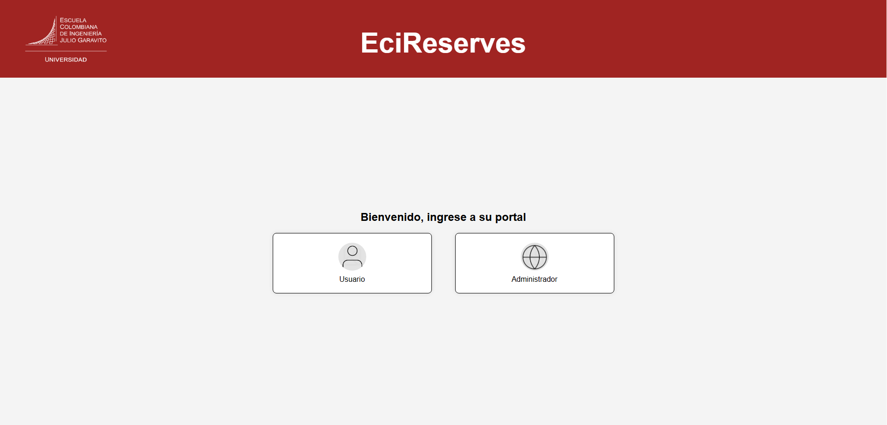
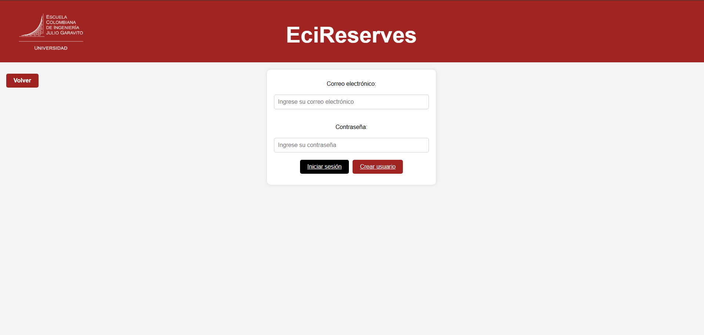
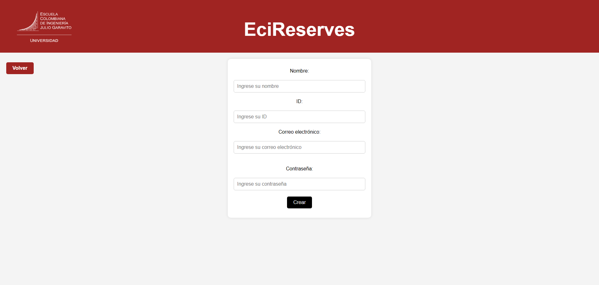
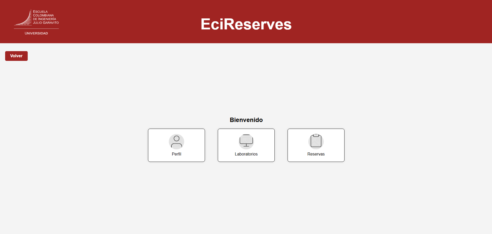
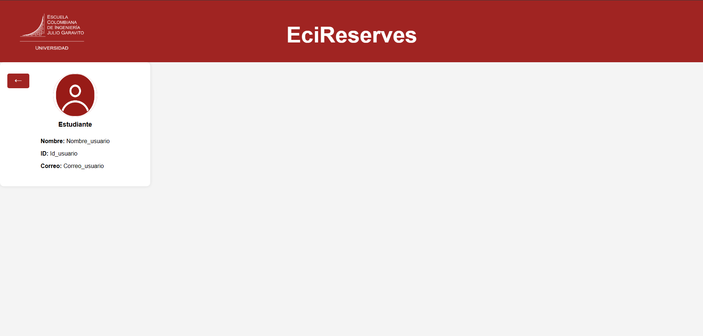
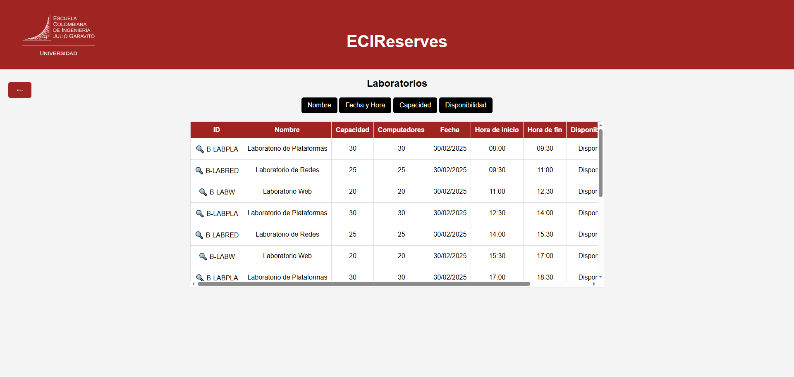
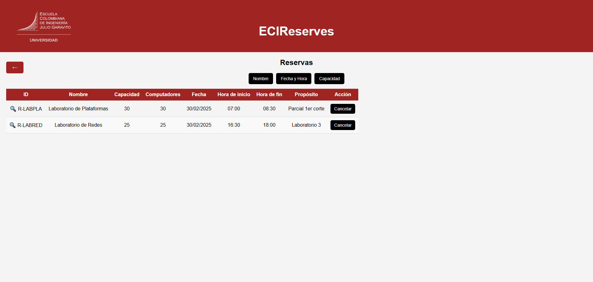

#  ECI Reserves GUI

Interfaz web para la gestión de reservas de laboratorios en la Escuela Colombiana de Ingeniería Julio Garavito.

##  Capturas de Pantalla

Index.html:

El usuario final se logea de acuerdo a si es Administrador o Usuario


Inicio de sesión:


Crear usuario:


Sesión iniciada de usuario:


Perfil de usuario:


Consultar laboratorios:


Gestionar mis reservas:


##  Características
-  Inicio de sesión para usuarios y administradores.
-  Gestión de laboratorios y reservas.
-  Creación y administración de usuarios.
-  Diseño responsivo.

## Tecnologías Usadas
- HTML, CSS, JavaScript
- Bootstrap (opcional)


##  Estructura del Proyecto

 ECIReservesGUI

┣  assets (Imágenes y recursos gráficos)

┣  screens (Interfaces HTML y CSS de la aplicación)

┣  scripts (Funciones JS como validación y formularios)

┣  index.html (Archivo principal)

┣  styles.css (Estilos globales)

┗  README.md (Este archivo)


## Cómo Usarlo
1. Clona este repositorio:
   ```sh
   git clone https://github.com/tuusuario/ECIReservesGUI.git

2. Abre index.html en tu navegador.


##  Autores
Andres Felipe Calderón - Desarrollador

Jesus Jauregui - Desarrollador

Natalia Espitia - Desarrollador

Santiago Hurtado - Desarrollador